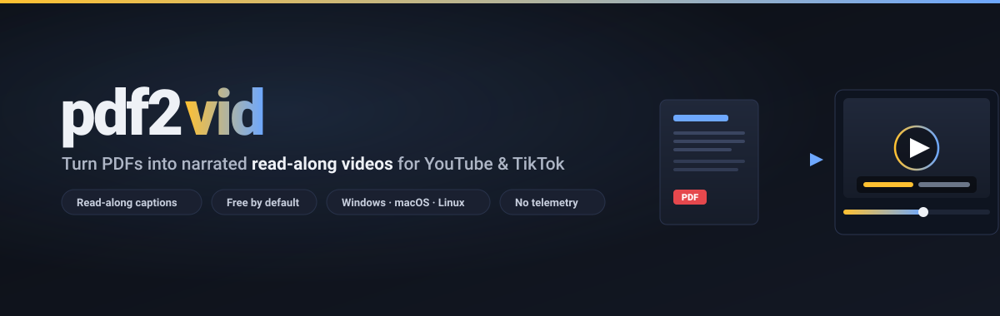
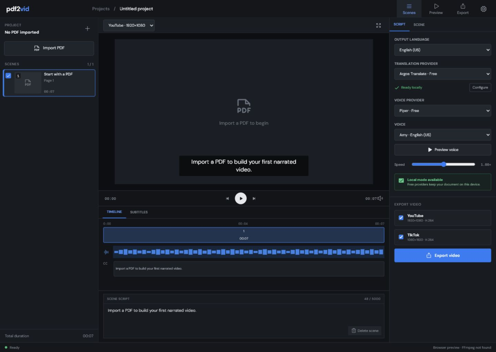

# pdf2vid

<p align="center">
  
</p>

<p align="center">
  <strong>Local-first desktop studio that turns text-based PDFs into narrated
  video projects for YouTube and TikTok.</strong>
</p>

<p align="center">
  <a href="https://github.com/wpggLabs/pdf2vid/actions/workflows/ci.yml"></a>
  <a href="https://wpggLabs.github.io/pdf2vid/"></a>
  <a href="LICENSE"></a>
  <a href="https://v2.tauri.app/"></a>
  <a href="https://react.dev/"></a>
  <a href="https://www.rust-lang.org/"></a>
  
</p>

<p align="center">
  <a href="#installation">Installation</a> &middot;
  <a href="#quick-start">Quick Start</a> &middot;
  <a href="#providers">Providers</a> &middot;
  <a href="docs/ARCHITECTURE.md">Architecture</a> &middot;
  <a href="docs/providers.md">Provider Reference</a> &middot;
  <a href="BUILDING.md">Building</a>
</p>

---

<p align="center">
  
</p>

## Highlights

- **Real PDF parsing** — text extraction, page thumbnails, scene selection, editable per-scene scripts
- **Read-along captions** — the on-screen text follows the narration line by line, word-accurate when using edge-tts
- **Premium render** — blurred, graded backdrop (no black bars), Ken Burns motion, vignette, and drop-shadow captions
- **Audio-accurate timing** — each scene's length is derived from the actual narration, not an estimate
- **YouTube 1920×1080** and **TikTok 1080×1920** full-length export
- **Free by default** — works with zero accounts, zero API keys, zero subscriptions
- **Rich provider registry** — voices (edge-tts, Kokoro, Chatterbox, OpenAI, ElevenLabs) and translation (Argos, OpenAI, Google Cloud)
- **Native FFmpeg integration** — system PATH or bundled sidecar
- **OS credential storage** — keys never written to project files
- **Live progress** with cancellation, debounced auto-save, and streaming PDF import
- **No telemetry** — runs fully offline once local models are installed
- **Cross-platform** — Windows 10+, macOS 11+, Ubuntu 22.04+

## Download

Grab the latest installer for your platform from the
[**Releases**](../../releases) page:

| Platform | File |
|---|---|
| Windows | `.msi` / `.exe` (NSIS) |
| macOS | `.dmg` (Apple Silicon) |
| Linux | `.AppImage` / `.deb` |

New releases are built automatically for all three platforms whenever a
`v*` tag is pushed. FFmpeg is bundled as a sidecar, so there's nothing
else to install for the free defaults.

> **Note:** pdf2vid is a native desktop app (Tauri + Rust + FFmpeg), so
> there is no in-browser version — the rendering and voice pipelines run
> locally on your machine. See the [project page](https://wpggLabs.github.io/pdf2vid/)
> for screenshots and a feature tour.

## Installation

### Windows

Download the latest `.msi` or `.exe` (NSIS) installer from the
[Releases](../../releases) page. Both bundle the FFmpeg sidecar and the
desktop runtime.

### macOS / Linux

See [BUILDING.md](BUILDING.md) for the build matrix or download the
appropriate `.dmg` / `.deb` / `.AppImage` / `.rpm` from the Releases page.

### Optional: edge-tts for the highest-quality free voice

The default voice provider (`edge-tts`) shells out to the Python `edge-tts`
package, which calls the free Microsoft Edge browser TTS endpoint. Install
it once:

```bash
pip install edge-tts
```

If `edge-tts` is unavailable, pdf2vid automatically falls back to
StreamElements (English) and Google Translate TTS (other languages). No
crash, no error.

## Quick Start

1. **Launch pdf2vid.** The status bar should read "Ready".
2. **Click Import PDF** in the top-left, or drag a PDF onto the window.
   Text-based PDFs work directly; scanned PDFs need OCR first.
3. **Pick the output language** and providers in the right inspector.
   Free defaults work without setup.
4. **Edit scene scripts** in the bottom editor. Each PDF page becomes
   one scene.
5. **Click Export video**, choose a folder, watch the progress bar.
   Cancel any time.

For higher quality, open **Settings**, paste an OpenAI or ElevenLabs API
key, and pick the cloud provider from the dropdown.

## Providers

pdf2vid exposes every stage through a single registry. The user picks one
provider per stage. The first option in each list is the free default.

| Stage | Free default | Also available | Notes |
|---|---|---|---|
| Translation | **Argos** (offline, MIT) | OpenAI, Google Cloud | `pip install argostranslate`; language packs auto-download on first use |
| Voice | **edge-tts** (Microsoft Neural via Python) | Kokoro, Chatterbox (local), OpenAI TTS, ElevenLabs | `pip install edge-tts`; falls back to StreamElements / Google TTS |
| Visual | PDF pages + Ken Burns + read-along captions | Higgsfield (coming soon) | Zero dependencies |
| Render | FFmpeg (system PATH or sidecar) | — | Bundled by default |

Local voice add-ons (great on a GPU): **Kokoro** (`pip install kokoro
soundfile`, Apache-2.0, 8 languages, fast on CPU) and **Chatterbox
Multilingual** (`pip install chatterbox-tts torchaudio`, MIT, 23
languages, expressive). Both fall back to edge-tts if not installed.

See [docs/providers.md](docs/providers.md) for the full per-provider
matrix with data flow, license, and network behavior.

## Repository Layout

```
pdf2vid/
├── assets/                  # README banner, screenshot
├── docs/
│   ├── ARCHITECTURE.md      # Backend/frontend architecture
│   ├── providers.md        # Provider reference
│   └── design/              # UI design references
├── src/                     # React + TypeScript frontend
│   ├── App.tsx              # Top-level component
│   ├── pdf.ts               # pdfjs-dist streaming import
│   ├── backend.ts           # Typed Tauri command/event wrappers
│   ├── components/          # Modal and view components
│   └── hooks/               # Timeline playback, preview voice, etc.
├── src-tauri/               # Rust backend
│   ├── src/
│   │   ├── lib.rs           # Tauri builder + command registration
   │   │   ├── commands.rs      # 21 #[tauri::command] handlers
│   │   ├── render.rs        # 4-stage export pipeline
│   │   ├── providers.rs     # Provider registry
│   │   ├── edgetts.rs       # edge-tts Python subprocess + subtitle cues
│   │   ├── kokoro.rs        # Kokoro local voice (Python subprocess)
│   │   ├── chatterbox.rs    # Chatterbox multilingual voice
│   │   ├── argos.rs         # Argos offline translation
│   │   ├── subprocess.rs    # Streaming subprocess helper (live progress)
│   │   ├── cloud.rs         # OpenAI, Google, ElevenLabs HTTP clients
│   │   ├── ffmpeg.rs        # FFmpeg detection + arg builders
│   │   └── state.rs         # AppState, JobHandle, cancel flag
│   ├── tauri.conf.json
│   ├── capabilities/
│   └── Cargo.toml
├── scripts/
│   └── fetch-ffmpeg.js      # Platform-specific FFmpeg downloader
├── BUILDING.md              # Build matrix per platform
├── CONTRIBUTING.md
├── SECURITY.md
└── LICENSE
```

## Development

Requirements: Node.js 20+, Rust stable, the
[Tauri 2 prerequisites](https://v2.tauri.app/start/prerequisites/), FFmpeg,
and FFprobe.

```bash
git clone https://github.com/wpggLabs/pdf2vid
cd pdf2vid
npm install
npm run tauri dev          # Development build with HMR
```

Web-only UI development (without the Rust shell):

```bash
npm run dev
```

Validation:

```bash
npm test                                                              # Vitest (frontend, fast)
npm run build                                                         # TypeScript + Vite production build
cargo test --manifest-path src-tauri/Cargo.toml --lib
cargo test --manifest-path src-tauri/Cargo.toml --test smoke_export -- --ignored --nocapture
cargo test --manifest-path src-tauri/Cargo.toml --test pdf_pipeline -- --ignored --nocapture
cargo test --manifest-path src-tauri/Cargo.toml --test audio_pipeline -- --ignored --nocapture
npm run tauri build -- --debug
```

`cargo test --test smoke_export -- --ignored` is the automated FFmpeg
end-to-end check: it generates placeholder PNGs + silent audio with
`ffmpeg -f lavfi`, runs the same filter graph production uses for
both 1920×1080 (YouTube) and 1080×1920 (TikTok), and probes the outputs
with `ffprobe`. The test asserts both files exist, both have a video
and audio stream, the resolutions match, and the duration is bounded
and finite.

`cargo test --test pdf_pipeline -- --ignored` is the real-PDF pipeline
proof: it parses `fixtures/clean-text-3page.pdf`,
`fixtures/mixed-blank-page.pdf`, `fixtures/non-english-3page.pdf`, and
`fixtures/scanned-or-image-page.pdf` with `pdf-extract`, builds a
`Project`, renders through the production filter graph, and verifies
the output with `ffprobe`. Requires `ffmpeg` + `ffprobe` on PATH and at
least one system font reachable from `pdf2vid_lib::font::resolve_font`.

`cargo test --test audio_pipeline -- --ignored` exercises the real
`edgetts::synthesize` path. When `python -m edge_tts` is available the
test produces a real MP3 and verifies bounded finite duration. When
edge-tts is unavailable the test prints a skip reason and exits
cleanly — no fake success.

### Real PDF fixtures

`fixtures/` contains four deterministic PDFs the integration tests
parse:

| Fixture | Pages | Text? | Used by |
|---|---|---|---|
| `clean-text-3page.pdf` | 3 | yes (English) | happy-path import + render |
| `mixed-blank-page.pdf` | 4 | yes on 1, 3, 4; page 2 is blank | skipped-page warning |
| `non-english-3page.pdf` | 3 | yes (Spanish) | non-Latin script import |
| `scanned-or-image-page.pdf` | 4 | no (image only) | OCR-required error path |

Regenerate with `python scripts/gen_pdf_fixtures.py` (uses `fpdf2` +
`pypdfium2`). The script verifies each fixture immediately after
generation.

### Manual QA outputs

`docs/manual_qa/` contains real MP4 exports and a typed
`qa-report.json`. Regenerate with:

```bash
cd src-tauri
cargo run --example qa_export
```

## Contributing

See [CONTRIBUTING.md](CONTRIBUTING.md). The non-negotiable rules:

1. Keep providers behind the provider registry in `src-tauri/src/providers.rs`
2. Never log API keys, PDF contents, or generated narration
3. Paid providers must never be selected automatically over a free local provider
4. Run the full test suite before submitting

## Security

Report vulnerabilities through GitHub Security Advisories. See
[SECURITY.md](SECURITY.md) for storage, network endpoints, and license gates.

## License

MIT — see [LICENSE](LICENSE).

---

<p align="center">
  <sub>Built with Tauri 2, React 19, Rust, pdfjs-dist, FFmpeg,
  <a href="https://github.com/rany2/edge-tts">edge-tts</a>, Kokoro,
  Chatterbox, and Argos Translate.</sub>
</p>